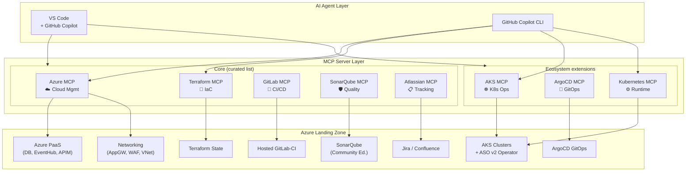
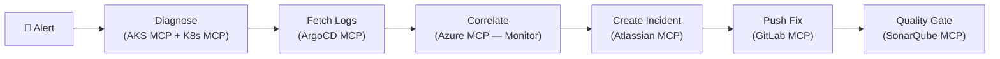
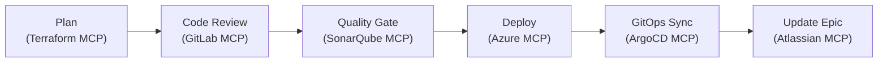
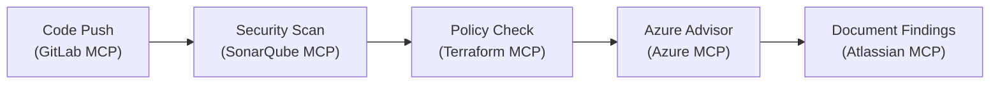
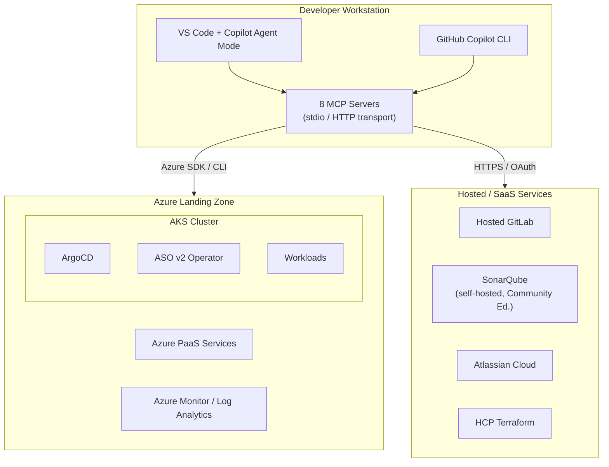

# Enhanced SRE Ecosystem — MCP-Augmented Azure Landing Zone

## 1. Vision

Leverage Model Context Protocol (MCP) servers to create an AI-assisted SRE ecosystem that unifies infrastructure management, code quality, GitOps delivery, project tracking, and documentation across an Azure Landing Zone.

MCP acts as a **universal bridge** between AI agents and operational tools, enabling natural language interaction with every layer of the stack.

---

## 2. Ecosystem Components

### 2.1 Azure Landing Zone Stack

```
┌──────────────────────────────────────────────────────┐
│                  Azure Landing Zone                   │
├──────────────────────────────────────────────────────┤
│  Compute    │ AKS (Kubernetes)                       │
│  PaaS       │ PostgreSQL, MySQL, WebApp, Event Hub   │
│  Network    │ APIM, App Gateway, WAF                 │
│  K8s-native │ Azure Service Operator (ASO v2)        │
│  Delivery   │ ArgoCD (GitOps), Hosted GitLab-CI      │
│  IaC        │ Terraform, ASO CRDs                    │
│  Quality    │ SonarQube (self-hosted, Community Ed.)  │
│  Tracking   │ Jira, Confluence (Atlassian)           │
└──────────────────────────────────────────────────────┘
```

### 2.2 MCP Client Environments (AI Hosts)

| Client | Role | MCP Transport | Use Case |
|---|---|---|---|
| **VS Code + GitHub Copilot** | Primary IDE | stdio / HTTP | Day-to-day development, agent mode, inline MCP tool calls |
| **GitHub Copilot CLI** | Terminal AI assistant | stdio | Quick CLI-based queries, scriptable automation, SRE operations |

### 2.3 MCP Server Inventory

#### Core MCP Servers (from curated list)

| MCP Server | Source | Primary SRE Domain | Transport |
|---|---|---|---|
| **Azure MCP** | Microsoft | Cloud resource management, monitoring, diagnostics | stdio / HTTP |
| **Terraform MCP** | HashiCorp | IaC documentation, registry, workspace management | stdio / HTTP |
| **GitLab MCP** | GitLab | CI/CD pipelines, merge requests, issues, code review | HTTP (OAuth) |
| **SonarQube MCP** | SonarSource | Code quality, security analysis, technical debt | stdio (Docker) |
| **Atlassian Rovo MCP** | Atlassian | Jira issues/epics, Confluence pages, search | HTTP (OAuth) |

#### Ecosystem MCP Servers (existing servers for ecosystem components)

| MCP Server | Source | Ecosystem Component | Transport |
|---|---|---|---|
| **AKS MCP** | [Azure/aks-mcp](https://github.com/Azure/aks-mcp) | AKS cluster ops, network, fleet, diagnostics | stdio / HTTP |
| **ArgoCD MCP** | [argoproj-labs/mcp-for-argocd](https://github.com/argoproj-labs/mcp-for-argocd) | GitOps delivery, app sync, rollback, resource tree | stdio / HTTP |
| **Kubernetes MCP** | [containers/kubernetes-mcp-server](https://github.com/containers/kubernetes-mcp-server) | Generic K8s CRUD, Helm, pod ops, events | stdio / HTTP |

**Total: 8 MCP servers** (5 core + 3 ecosystem)

---

## 3. Architecture Overview



### 3.1 Ecosystem Coverage Map

| Ecosystem Component | Core MCP | Ecosystem MCP | Combined Capabilities |
|---|---|---|---|
| **AKS (Kubernetes)** | Azure MCP | AKS MCP, Kubernetes MCP | Azure MCP: resource-level mgmt, Monitor, Advisor. AKS MCP: cluster ops, fleet, VMSS, diagnostics. K8s MCP: native API CRUD, Helm, pod exec/logs |
| **Azure PaaS** | Azure MCP | — | 40+ services: PostgreSQL, MySQL, WebApp, Event Hub, APIM, App Gateway, WAF, Key Vault, Storage |
| **ASO v2** | Azure MCP | Kubernetes MCP | Azure MCP: inspect provisioned Azure resources. K8s MCP: manage ASO CRDs via `kubectl apply` |
| **ArgoCD GitOps** | — | ArgoCD MCP | App sync, rollback, resource tree, workload logs, cluster management |
| **Hosted GitLab-CI** | GitLab MCP | — | Projects, merge requests, issues, pipelines via OAuth |
| **Terraform IaC** | Terraform MCP | — | Registry docs, modules, providers, workspace management, runs, policy validation |
| **SonarQube** | SonarQube MCP | — | Quality gates, security analysis on self-hosted Community Edition |
| **Jira / Confluence** | Atlassian MCP | — | Issue tracking, epics, Confluence pages, Rovo semantic search |

---

## 4. MCP Server Capabilities

### 4.1 Azure MCP Server (Core)

**Role**: Cloud resource lifecycle, monitoring, diagnostics, best practices.

- **Azure resource management**: List/create/update subscriptions, resource groups, storage accounts, Key Vault secrets, Cosmos DB, compute (VMs, VMSS, disks)
- **Terraform integration**: AzureRM/AzAPI provider docs, Azure Verified Modules, resource export to Terraform, policy validation via conftest
- **Diagnostics**: Azure Monitor metrics, resource health, App Insights KQL queries, Azure Advisor recommendations
- **Modes**: namespace (default), consolidated (recommended for agents), all, single
- **Azure CLI generate**: Generate Azure CLI commands from natural language intent

### 4.2 Terraform MCP Server (Core)

**Role**: Infrastructure as Code documentation, module discovery, workspace management.

- **Registry tools**: Search/get providers, modules, policies with latest versions
- **HCP Terraform/Enterprise**: Workspace CRUD, runs, variables, variable sets, tags, policy sets
- **Stacks**: List and inspect Terraform Stacks for multi-environment rollouts
- **Security**: Destructive ops disabled by default (`ENABLE_TF_OPERATIONS` flag)

### 4.3 GitLab MCP Server (Core)

**Role**: CI/CD pipeline management, code review, issue tracking on **hosted GitLab** instance.

- **Project access**: Browse projects, issues, merge requests
- **API integration**: Full GitLab API via OAuth 2.0 dynamic client registration
- **ArgoCD synergy**: Manages the Git repositories and CI/CD pipelines that ArgoCD syncs from
- **Security**: OAuth 2.0, prompt injection awareness

### 4.4 SonarQube MCP Server (Core)

**Role**: Code quality gates, security vulnerability detection, technical debt analysis.

- **Analysis**: Code snippet analysis within agent context
- **Integration**: Connects to a **self-hosted SonarQube Community Edition** instance
- **Docker-based**: MCP server runs as `mcp/sonarqube` container image, connects via `SONARQUBE_URL`
- **Authentication**: Token-based, environment variable security best practices
- **Community Edition scope**: Quality profiles, issues, hotspots, quality gates (branch analysis and advanced security features require higher editions)

### 4.5 Atlassian Rovo MCP Server (Core)

**Role**: Project management, documentation, cross-tool context.

- **Rovo search**: Semantic search across Jira and Confluence
- **Jira**: Create/link epics and issues in correct projects
- **Confluence**: Create/update pages with generated specs or summaries
- **Enterprise**: Admin controls, audit logs, MCP client allow-lists

### 4.6 AKS MCP Server (Ecosystem)

**Role**: AKS-specific operations, diagnostics, network, fleet management.

- **Unified tools**: `call_az` for Azure CLI, `call_kubectl` for Kubernetes ops
- **Network resources**: VNet, Subnet, NSG, Route Table, Load Balancer, Private Endpoint
- **Monitoring**: Metrics, resource health, App Insights, control plane logs, diagnostic detectors
- **Fleet management**: Multi-cluster operations, update runs, ClusterResourcePlacement
- **Compute**: VMSS info, node logs collection, VM operations
- **Access levels**: readonly (default), readwrite, admin

### 4.7 ArgoCD MCP Server (Ecosystem)

**Role**: GitOps delivery lifecycle, application management, troubleshooting.

- **Application management**: List, get, create, update, delete, sync applications
- **Resource inspection**: Resource tree, managed resources, workload logs, events
- **Resource actions**: Get and run available actions on resources
- **Cluster management**: List registered clusters
- **Safety**: Read-only mode available (`MCP_READ_ONLY=true`)

### 4.8 Kubernetes MCP Server (Ecosystem)

**Role**: Direct Kubernetes API interaction, Helm, cross-cluster operations.

- **Native Go implementation**: No kubectl dependency, direct K8s API interaction
- **Resource management**: CRUD on any K8s/OpenShift resource (including ASO CRDs)
- **Pod operations**: Logs, exec, top, run
- **Helm**: Install, list, uninstall charts
- **Observability**: OpenTelemetry tracing and metrics

#### Azure Service Operator (ASO v2) — Integration Note

ASO v2 is a **Kubernetes operator** (not an MCP server) that provisions Azure resources via `kubectl apply` using CRDs. It is manageable through both the **Kubernetes MCP** and **AKS MCP** servers:

- **Create/update/delete ASO resources**: via Kubernetes MCP (`apply_manifest`) or AKS MCP (`call_kubectl`)
- **Inspect ASO resource status**: via Kubernetes MCP (`get_resource`) — ASO exposes Azure state in the CRD `.status` field
- **Combined with KRO** (Kubernetes Resource Orchestrator): enables golden path abstractions orchestrating multiple ASO resources as a single CRD

ASO covers 40+ Azure services as CRDs: ResourceGroup, ManagedCluster, PostgreSQL, MySQL, EventHub, APIM, AppGateway, StorageAccount, KeyVault, and more.

---

## 5. SRE Workflows Enhanced by MCP

### 5.1 Incident Response



**Natural language workflow**:
1. _"What pods are degraded in the production AKS cluster?"_ → AKS MCP / K8s MCP
2. _"Show me the ArgoCD sync status for the payment-service app"_ → ArgoCD MCP
3. _"Query Log Analytics for errors in the last hour"_ → Azure MCP
4. _"Create a P1 Jira incident linked to the payment service Confluence page"_ → Atlassian MCP
5. _"Show me the latest merge requests on the payment-service repo"_ → GitLab MCP
6. _"Check the SonarQube quality gate for the hotfix branch"_ → SonarQube MCP

### 5.2 Infrastructure Provisioning



**Natural language workflow**:
1. _"Show me the Terraform AzureRM docs for azurerm_kubernetes_cluster"_ → Terraform MCP
2. _"Search Azure Verified Modules for AKS"_ → Terraform MCP
3. _"Create a merge request for the infra changes"_ → GitLab MCP
4. _"Check SonarQube quality gate for the terraform-infra project"_ → SonarQube MCP
5. _"List my resource groups in subscription X"_ → Azure MCP
6. _"Sync the infrastructure ArgoCD app"_ → ArgoCD MCP
7. _"Update the Jira epic with deployment status"_ → Atlassian MCP

### 5.3 Continuous Quality & Security



### 5.4 Architecture Documentation

**Natural language workflow**:
1. _"Find the latest incident postmortem for checkout failures"_ → Atlassian MCP (Rovo search)
2. _"List all AKS clusters and their network configuration"_ → AKS MCP
3. _"Export the production resource group to Terraform"_ → Azure MCP (Terraform tools)
4. _"Create a Confluence page with the current architecture state"_ → Atlassian MCP

---

## 6. Security Model

### 6.1 Authentication per MCP Server

| MCP Server | Auth Method | Secret Management |
|---|---|---|
| Azure MCP | Entra ID / Azure CLI / Managed Identity | Azure RBAC |
| Terraform MCP | TFE_TOKEN API token | Environment variable |
| GitLab MCP | OAuth 2.0 Dynamic Client Registration | OAuth flow |
| SonarQube MCP | User token | Environment variable |
| Atlassian MCP | OAuth (Atlassian-hosted) | Admin-controlled allow-list |
| AKS MCP | Azure CLI (`az login`) | Environment variables |
| ArgoCD MCP | API token (Bearer) | Environment variable |
| Kubernetes MCP | kubeconfig / ServiceAccount | K8s RBAC |

### 6.2 Safety Controls

- **Read-only defaults**: Azure MCP, AKS MCP (readonly access level), ArgoCD MCP (`MCP_READ_ONLY`)
- **Destructive op gating**: Terraform MCP (`ENABLE_TF_OPERATIONS`), AKS MCP (access levels)
- **Elicitation**: Azure MCP requires user confirmation for sensitive data (Key Vault secrets)
- **RBAC inheritance**: AKS MCP inherits user's Azure RBAC and K8s RBAC permissions
- **Audit**: Atlassian MCP provides usage logs; Azure MCP integrates with Azure activity logs

---

## 7. Deployment Topology



### 7.1 MCP Client Setup

#### VS Code — Copilot Agent Mode

VS Code with GitHub Copilot in **Agent mode** natively supports MCP servers. Configuration goes in `.vscode/mcp.json` (workspace) or User Settings JSON (global). All 8 MCP servers are available, with tool calls invoked inline during chat.

#### GitHub Copilot CLI

Copilot CLI supports MCP via the `/mcp add` command. Best suited for quick infrastructure queries, scriptable automation, and SRE operations from the terminal. Supports stdio transport.

### 7.2 MCP Server Configuration (shared across clients)

```json
{
  "mcpServers": {
    "azure": {
      "command": "npx",
      "args": ["-y", "@azure/mcp@latest", "server", "start", "--mode", "consolidated"]
    },
    "terraform": {
      "command": "docker",
      "args": ["run", "-i", "--rm", "-e", "TFE_TOKEN", "hashicorp/terraform-mcp-server"],
      "env": {
        "TFE_TOKEN": "<token>"
      }
    },
    "gitlab": {
      "type": "http",
      "url": "https://gitlab.example.com/api/v4/mcp"
    },
    "sonarqube": {
      "command": "docker",
      "args": ["run", "--init", "-i", "--rm", "-e", "SONARQUBE_TOKEN", "-e", "SONARQUBE_URL", "mcp/sonarqube"],
      "env": {
        "SONARQUBE_TOKEN": "<token>",
        "SONARQUBE_URL": "<self-hosted-sonarqube-url>"
      }
    },
    "atlassian": {
      "type": "http",
      "url": "https://mcp.atlassian.com/v2/mcp"
    },
    "aks": {
      "command": "aks-mcp",
      "args": ["--transport", "stdio", "--access-level", "readwrite"]
    },
    "argocd": {
      "command": "npx",
      "args": ["argocd-mcp@latest", "stdio"],
      "env": {
        "ARGOCD_BASE_URL": "<argocd_url>",
        "ARGOCD_API_TOKEN": "<argocd_token>"
      }
    },
    "kubernetes": {
      "command": "npx",
      "args": ["-y", "kubernetes-mcp-server@latest"]
    }
  }
}
```

---

## 8. Recommended Phased Adoption

### Phase 1 — Observability & Documentation (Low Risk)
→ **[Implementation Guide](phase1-observability-documentation.md)**
- Deploy Azure MCP (read-only / consolidated mode) for resource discovery and monitoring
- Deploy AKS MCP (readonly) for cluster health and diagnostics
- Deploy Kubernetes MCP for pod logs and event inspection
- Deploy Atlassian MCP for incident documentation and Rovo search

### Phase 2 — IaC & Quality (Medium Risk)
→ **[Implementation Guide](phase2-iac-quality.md)**
- Add Terraform MCP (registry tools only, no TFE_TOKEN) for documentation lookup
- Add SonarQube MCP for quality gate monitoring on self-hosted Community Edition
- Add GitLab MCP for merge request and pipeline status on hosted GitLab

### Phase 3 — Delivery & Operations (Higher Risk, Controlled)
→ **[Implementation Guide](phase3-delivery-operations.md)**
- Enable ArgoCD MCP for sync operations (with read-only mode first)
- Enable Terraform MCP workspace management (with TFE_TOKEN)
- Enable AKS MCP readwrite access level for scaling and updates
- Enable Azure MCP write operations for resource management

---

## 9. Key Benefits

| Benefit | Description |
|---|---|
| **Unified context** | Single AI conversation spanning infra, code, delivery, and tracking via 8 MCP servers |
| **Reduced MTTR** | Incident diagnosis through correlated data from AKS MCP, Azure MCP, ArgoCD MCP |
| **IaC acceleration** | Real-time Terraform docs and Azure Verified Module discovery during authoring |
| **Full GitOps visibility** | ArgoCD MCP for delivery + GitLab MCP for pipelines + K8s MCP for runtime |
| **K8s-native Azure mgmt** | ASO v2 resources managed via Kubernetes MCP and AKS MCP |
| **Audit trail** | Every MCP action traced through native tool audit logs |
| **Progressive safety** | Read-only defaults with explicit opt-in for mutations |
| **Knowledge capture** | Auto-document decisions in Confluence from operational context |
