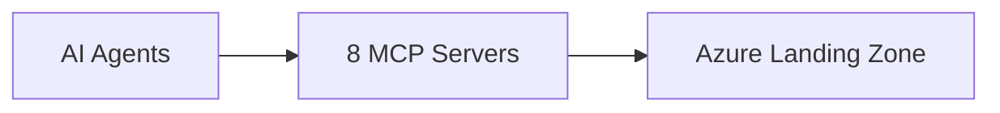

# Enhanced SRE Ecosystem

An **MCP-augmented Azure Landing Zone** architecture that leverages 8 Model Context Protocol servers to unify infrastructure management, code quality, GitOps delivery, project tracking, and documentation through AI-assisted workflows.

## Overview

This project designs an enhanced SRE ecosystem where AI agents (VS Code + GitHub Copilot, Copilot CLI) interact with Azure Landing Zone components through standardized MCP servers.

## MCP Server Stack

| Server | Domain |
|---|---|
| **Azure MCP** | Cloud resource management, monitoring, diagnostics |
| **Terraform MCP** | IaC documentation, registry, workspace management |
| **GitLab MCP** | CI/CD pipelines, merge requests, code review |
| **SonarQube MCP** | Code quality gates, security analysis |
| **Atlassian MCP** | Jira issues, Confluence pages, search |
| **AKS MCP** | AKS cluster ops, network, fleet management |
| **ArgoCD MCP** | GitOps delivery, app sync, rollback |
| **Kubernetes MCP** | Generic K8s CRUD, Helm, pod operations |

## Documentation

- [**Architecture Overview**](enhanced-sre-architecture.md) — Full ecosystem design, capabilities matrix, workflows, security model
- [**Phase 1 — Observability & Documentation**](phase1-observability-documentation.md) — Deploy 4 read-only MCP servers
- [**Phase 2 — IaC & Quality**](phase2-iac-quality.md) — Add Terraform, SonarQube, GitLab MCP servers
- [**Phase 3 — Delivery & Operations**](phase3-delivery-operations.md) — Enable write operations and ArgoCD GitOps

## Phased Adoption

| Phase | Risk | Servers | Focus |
|---|---|---|---|
| Phase 1 | Low | Azure, AKS, Kubernetes, Atlassian | Read-only observability & documentation |
| Phase 2 | Medium | + Terraform, SonarQube, GitLab | IaC docs & quality gates |
| Phase 3 | Higher | + ArgoCD, write operations | Full delivery & operations |
